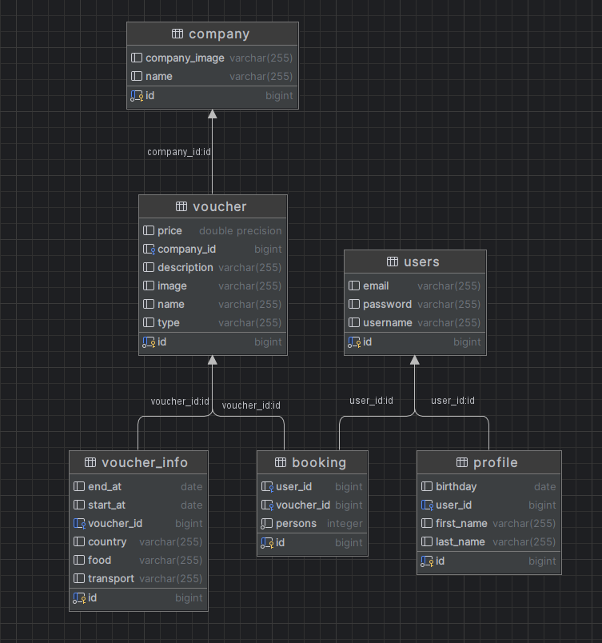

<h1 align="center">Travel.by</h1>

      

## About

"Travel.by" is a web application for booking travel packages. 
This application is developed using Java 19 as the primary programming language and incorporates 
technologies and tools such as Hibernate for working with the PostgreSQL database, 
Apache Tomcat 10.1.8 for deploying the web application, as well as CSS, JavaScript, JSP, and Log4J 
for creating the interface, client-side components, and logging.

## Features

### For Users:
* **Registration and Authentication**: Users can register on the website by creating their account and then log in using their credentials.

* **View Available Travel Packages**: The system provides an extensive database of travel packages that users can browse based on various criteria, such as location, duration, cost, and more.

* **Booking Travel Packages**: After finding a travel package that suits their preferences, users can make a reservation by selecting convenient dates and options.

* **User Dashboard**: Each user has their personal dashboard where they can manage their data, including personal information.

* **Cancellation of Reservations**: In their dashboard, users can also cancel their travel package reservations if they change their plans or decisions.

### For users (Future Features)
* **Sorting Travel Packages**: Users will have the ability to sort travel packages based on various parameters for ease of selection.
* **Search for Travel Packages by name**: Users can search for travel packages by name using a search bar, making it easier to find specific packages of interest.

### For Companies (Future Features):
**Company Registration and Login**: Travel companies will be able to register and log in to the system on behalf of their company.

**Management of Company's Travel Packages**: Registered companies will be able to manage the list of travel packages they offer in their personal dashboard.

**User Management**: Companies will have the ability to manage user data for individuals who have booked travel packages with their company.

## Technologies
The project utilizes the following technologies and libraries:

* **Java 19**: As the primary programming language.
* **Hibernate**: For working with the PostgreSQL database. Version 6.3.0.CR1.
* **PostgreSQL**: As the database for storing information about travel packages and users. Version 42.6.0.
* **Apache Tomcat 10.1.8**: For deploying the web application.
* **CSS, JavaScript, JSP**: For creating the user interface and client-side components.
* **Log4J**: For logging events and debugging.
* **JUnit 5**: For testing the application.

## Database Setup

Scripts for creating the database can be found in the script.sql file. To set up the database, execute the scripts provided in this file.

## Monitor Compatibility
This project is optimized for correct display on a 27'' monitor. The layout and interface are designed with this specific screen configuration in mind, ensuring the best user experience on a 27'' monitor.

## Installation and Running

* Clone the repository from GitHub.
* Create the PostgreSQL database and configure the Hibernate configuration.
* Start Apache Tomcat and deploy the web application.
* Access the application in a web browser (http://localhost:8080/travel_by).
### Application's home page

## Contributing to the Project

We welcome contributions from the community! If you have suggestions for improving the project, fixing bugs, or any other questions, please create a Pull Request or Issue on GitHub.

## License

This project is licensed under the terms of the MIT License.

## Authors

* Alexandr Ermakov (ermakov.sascha2015yandex.ru@gmail.com)